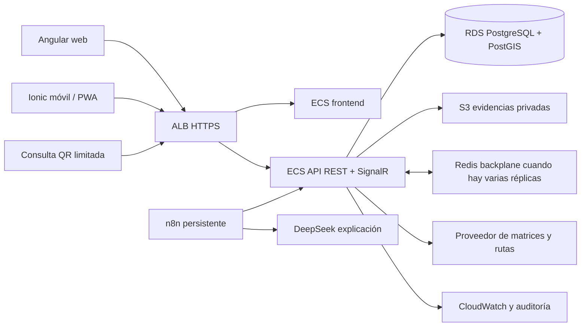

# Arquitectura del sistema

**Base:** stack propuesto por IstpetDev. Arquitectura objetivo; no es un despliegue realizado.

## Diseño inicial

Una **API modular** en C# concentra reglas de inventario, rutas, custodia y autorización **RBAC con validación por recurso**, según [[Seguridad y evidencias]]. Clean Architecture separa dominio, casos de uso, adaptadores y HTTP. CQRS organiza comandos y consultas en la misma aplicación y PostgreSQL inicialmente; bases distintas solo se justificarían con evidencia de carga.

Angular web usa **Feature-Sliced Design**, descrito en [[Frontend con Feature-Sliced Design]]. Angular web e Ionic móvil consumen el mismo contrato. n8n orquesta tareas externas; la API sigue siendo dueña del estado operativo.

## Módulos de dominio

| Módulo | Función | Fuente |
|---|---|---|
| Inventario | SKU, lotes, reservas, consumos, movimientos | [[Modelo de datos]] |
| Riesgo | Cobertura, faltantes y anomalías | [[Inventario y prediccion]] |
| Logística | Solicitudes, vehículos, rutas y paradas | [[Rutas y sobrecostos]] |
| Custodia | QR, despacho, recepción y evidencia | [[Seguridad y evidencias]] |
| Comunicación | Alertas, incidentes y chat durable | [[Backend y tiempo real]] |
| Evaluación | Simulador, resultados y exportaciones | [[Simulador y metricas]] |

Las dependencias del dominio no apuntan a AWS, n8n o DeepSeek.

## Propiedad de los datos

- PostgreSQL es la fuente de verdad de movimientos y estados aceptados.
- La base local móvil conserva operaciones pendientes; no impone un saldo final al servidor.
- S3 guarda archivos; PostgreSQL conserva metadatos y vínculo con la recepción.
- SignalR avisa de cambios; consultar API recupera estado e historial.
- n8n consume y escribe mediante endpoints limitados; no altera tablas operativas directamente.
- El proveedor vial entrega distancias/tiempos; el algoritmo de planificación decide las asignaciones.
- La IA genera explicaciones de cálculos existentes; no confirma stock, rutas ni entregas.

## Límite transaccional

Cada escritura crítica valida identidad, permisos, versión e idempotencia. En una transacción registra movimiento, actualiza proyección de stock y añade evento/outbox. Un publicador procesa el outbox después del commit. Consumidores y clientes toleran eventos repetidos.

Las evidencias pueden cargarse después. La interfaz distingue recepción aceptada, archivos pendientes y trazabilidad completa.

## Entornos

- **Local:** Docker Compose para dependencias; endpoints de prueba y datos sintéticos.
- **Demo AWS:** configuración medida y acotada; restricciones explícitas.
- **Operación nacional:** perfil con varias zonas, respaldo, límites y recuperación probados.

Ver [[AWS y Terraform]] y [[Decisiones de arquitectura]].

## Correcciones a la propuesta inicial

| Idea inicial | Ajuste necesario |
|---|---|
| CQRS separa completamente todo | Separación lógica primero; no implica dos bases ni dos servicios |
| UUID v7 impide colapsar | Puede favorecer localidad temporal; índices/consultas/carga se deben medir |
| Service worker sincroniza todo | Cola durable propia y recuperación en primer plano; soporte de fondo varía |
| Autoescalar basta para SignalR | Backplane y configuración de afinidad/reconexión |
| Historial inmutable | Solo append en permisos de aplicación; protección adicional requiere diseño y pruebas |
| IA predice los días | Modelo numérico comprobable primero; LLM explica y contextualiza |

Estas precisiones sustentan el diseño, no reducen el alcance solicitado.
