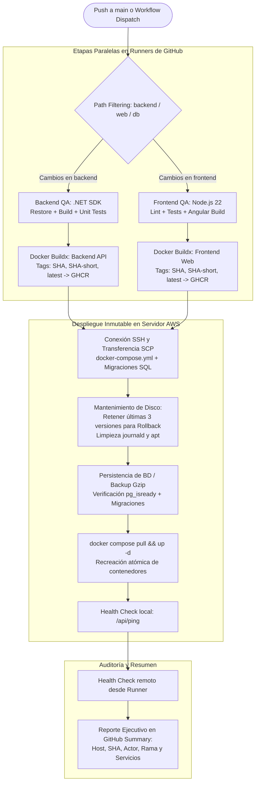

# CI/CD y automatización de despliegue

> [!warning] Ejemplo no probado
> Los bloques de código de esta nota (configuración, scripts, YAML, HCL, comandos) son ejemplos de diseño: no se han ejecutado ni probado en un repositorio. No copiarlos como si estuvieran validados; cada uno se verifica al implementarlo y se enlaza su evidencia. Versiones, rutas y puertos vigentes: [[Hechos canonicos]].

Este documento define la arquitectura de **Integración Continua, Entrega Continua (CI/CD) y recuperación por rollback** para la plataforma de IstpetDev.

El diseño se basa en un **Grafo Acíclico Dirigido (DAG)** multi-etapa implementado con **GitHub Actions**, registro de imágenes en **GitHub Container Registry (GHCR)** y despliegue inmutable sobre infraestructura cloud (AWS EC2 / VPS Hardened) mediante SSH y Docker Compose.



---

## 1. Principios del Pipeline

1. **Compilación Exclusiva en Runners:** El servidor de producción nunca compila código fuente, no instala SDKs de compilación ni ejecuta `npm install` o `dotnet build`. Toda la compilación y pruebas ocurren en runners efímeros de GitHub Actions para evitar saturación de memoria RAM y CPU en el host.
2. **Imágenes Inmutables Etiquetadas por Commit SHA:** Cada artefacto se etiqueta con el hash del commit (`:${{ github.sha }}`) y su versión corta (`:${{ steps.vars.outputs.sha_short }}`), impidiendo ambigüedad de versiones o sobreescritura ciega de `:latest`.
3. **Caché Remoto en GitHub Actions:** Uso de `cache-from: type=gha` y `cache-to: type=gha,mode=max` con Docker Buildx para reducir el tiempo de compilación de minutos a segundos.
4. **Retención de imágenes para rollback rápido:** El servidor anfitrión mantiene siempre en caché local las **últimas 3 versiones de imágenes**, permitiendo volver a la versión previa en segundos sin depender de internet o de re-compilaciones.
5. **Idempotencia y Respaldo Preventivo de Base de Datos:** Antes de aplicar cualquier cambio o migración de esquema en la base de datos, el pipeline ejecuta un snapshot comprimido en `/backups/`.
6. **Cero Secretos en el Repositorio:** Toda credencial se inyecta desde GitHub Repository Secrets (`EC2_HOST`, `EC2_USER`, `EC2_SSH_KEY`).

---

## 2. Especificación de Workflows de GitHub Actions

### 2.1 Workflow Principal: Despliegue Multi-Etapa DAG (`.github/workflows/deploy.yml`)

#### Disparadores y Parámetros
* **Automático:** Push a la rama `main` filtrando rutas (`backend/**`, `apps/web/**`, `scripts/base_datos/**`, `docker-compose.yml`, `.github/workflows/deploy.yml`).
* **Manual (`workflow_dispatch`):**
  * `restart_only` (booleano): Reinicia los contenedores en el servidor sin recompilar ni descargar imágenes (ideal para resolver bloqueos o caídas en 10 segundos).
  * `reset_database` (booleano): Opcional para entornos de prueba; genera backup preventivo antes de recrear el esquema limpio.

#### Estructura de Trabajos (Jobs):

| Job | Condición / Dependencias | Acción Principal |
|---|---|---|
| `quick-restart` | `inputs.restart_only == 'true'` | SSH al servidor → `docker compose restart` → Health check `/api/ping`. |
| `detect-changes` | `inputs.restart_only != 'true'` | `dorny/paths-filter@v3` para determinar si cambió backend, frontend o base de datos. |
| `backend-qa` | Cambios en backend o disparo manual | Setup .NET (versión ADR-01) → `dotnet restore` → `dotnet build -c Release` → `dotnet test --no-build`. |
| `frontend-qa` | Cambios en web o disparo manual | Setup Node.js 22 → `npm install` → `npm test` → `npm run build`. |
| `build-backend` | Éxito en `backend-qa` | Docker Buildx → Push a `ghcr.io/<owner>/istpetdev-backend:<sha>` con caché GHA. |
| `build-frontend` | Éxito en `frontend-qa` | Docker Buildx → Push a `ghcr.io/<owner>/istpetdev-web:<sha>` con caché GHA. |
| `deploy-ec2` | Éxito en `build-backend` y `build-frontend` | Conexión SSH → Mantenimiento de disco → Pull de imágenes → Verificación BD → `docker compose up -d`. |
| `health-check-report` | Éxito en `deploy-ec2` | Verificación de endpoint en vivo y reporte en `$GITHUB_STEP_SUMMARY`. |

#### Lógica del Despliegue en el Host (Script SSH en `deploy-ec2`):
```bash
set -e
cd /var/www/istpetdev

# 1. Mantenimiento Preventivo de Disco (Rotación de imágenes para Rollback)
docker image prune -f
for img in istpetdev-backend istpetdev-web; do
  docker images --filter "reference=*${img}*" --format "{{.ID}}" | sort -u | tail -n +4 | xargs -r docker rmi -f 2>/dev/null || true
done
sudo journalctl --vacuum-size=20M 2>/dev/null || true

# 2. Autenticación en GHCR
echo "${{ secrets.GITHUB_TOKEN }}" | docker login ghcr.io -u "${{ github.actor }}" --password-stdin

# 3. Selección de Tag Inmutable
OWNER_LOWER=$(echo "${{ github.repository_owner }}" | tr '[:upper:]' '[:lower:]')
export BACKEND_IMAGE="ghcr.io/${OWNER_LOWER}/istpetdev-backend:${{ github.sha }}"
export FRONTEND_IMAGE="ghcr.io/${OWNER_LOWER}/istpetdev-web:${{ github.sha }}"

# 4. Descarga de Imágenes
docker compose pull --quiet

# 5. Inicialización y Salud de la Base de Datos
docker compose up -d istpetdev-db
# Espera de disponibilidad de PostgreSQL
docker compose exec -T istpetdev-db pg_isready -h localhost -p 5432 -U istpetdev_user --timeout=30

# 6. Respaldo Preventivo antes de aplicar cambios
mkdir -p backups
docker compose exec -T istpetdev-db pg_dump -U istpetdev_user istpetdev_db | gzip > "backups/pre_deploy_$(date +%Y%m%d_%H%M%S).sql.gz" || true

# 7. Recreación Atómica de Contenedores de Aplicación
docker compose up -d --force-recreate --remove-orphans istpetdev-backend istpetdev-web
docker image prune -f

# 8. Comprobación de Salud Interna
sleep 5
curl -sf http://localhost:5000/api/ping && echo "API IstpetDev OK" || echo "Advertencia: inicialización en progreso"
```

---

### 2.2 Workflow de rollback rápido (`.github/workflows/rollback.yml`)

Objetivo: restaurar una versión previa en menos de 30 segundos sin recompilar. El tiempo no se ha medido.

#### Parámetros (`workflow_dispatch`):
* `target_sha` (string, obligatorio): Commit SHA de 40 o 7 caracteres (ej. `b38b073`) o tag específico.

#### Ejecución del Rollback:
```bash
set -e
cd /var/www/istpetdev

OWNER_LOWER=$(echo "${{ github.repository_owner }}" | tr '[:upper:]' '[:lower:]')
export BACKEND_IMAGE="ghcr.io/${OWNER_LOWER}/istpetdev-backend:${{ inputs.target_sha }}"
export FRONTEND_IMAGE="ghcr.io/${OWNER_LOWER}/istpetdev-web:${{ inputs.target_sha }}"

echo "Descargando imágenes correspondientes a ${{ inputs.target_sha }}..."
docker compose pull --quiet

echo "Reiniciando servicios con la versión solicitada..."
docker compose up -d --remove-orphans

echo "Verificando disponibilidad inmediata..."
sleep 5
curl -sf http://localhost:5000/api/ping && echo "Rollback completado exitosamente"
```

---

### 2.3 Workflow de Integración Continua para Desarrollo (`.github/workflows/ci.yml`)

Disparado en cada push a la rama `develop` y en la apertura de Pull Requests hacia `main` o `develop`:
* Checkout del código.
* Setup del SDK .NET (versión ADR-01) y ejecución de `dotnet test`.
* Setup de Node.js 22 y ejecución de pruebas de frontend (`npm test` y compilación de prueba).
* Validación estricta sin ejecutar despliegue a producción.

---

## 3. Matriz de Variables y Secretos Requeridos

| Secreto / Variable | Entorno | Propósito |
|---|---|---|
| `EC2_HOST` | GitHub Secrets | Dirección IP elástica o dominio del servidor de producción. |
| `EC2_USER` | GitHub Secrets | Usuario operativo no privilegiado configurado en el servidor (`deployer`). |
| `EC2_SSH_KEY` | GitHub Secrets | Llave privada Ed25519 para autenticación por llave pública hacia el servidor. |
| `GITHUB_TOKEN` | Generado automáticamente | Token nativo de GitHub Actions para publicar y descargar imágenes en GHCR. |
| `DEPLOY_DIR` | Variable de Entorno | Directorio base de despliegue en el servidor (`/var/www/istpetdev`). |

---

## 4. Auditoría y Reporte Ejecutivo Post-Despliegue

Cada ejecución del pipeline genera automáticamente un reporte en el resumen de la ejecución de GitHub (`$GITHUB_STEP_SUMMARY`):

```markdown
# Reporte Ejecutivo de Despliegue CI/CD — IstpetDev

| Parámetro | Valor |
| :--- | :--- |
| **Estado** | Despliegue Exitoso en Producción |
| **Host de Destino** | `<IP_SERVIDOR>` |
| **Commit SHA** | `b38b073` |
| **Desplegado por** | @bryancito1090 |
| **Rama** | `main` |

### Servicios Verificados:
- **IstpetDev Backend (.NET Web API)**: Puerto 5000 en loopback, Clean Architecture, PostgreSQL PostGIS, SignalR.
- **IstpetDev Web (Angular Standalone FSD)**: Puerto 80/443 vía Nginx Proxy Inverso, compresión y rutas SPA.
- **Base de Datos (PostgreSQL + PostGIS)**: Puerto 5432 en loopback con backup preventivo en `/backups/`.
```

## Fallos y pendientes conocidos del diseño

Detectados en la revisión del 7 de octubre de 2026. Corregir antes de convertir este diseño en archivos `.github/workflows/`.

| Problema | Efecto | Corrección propuesta |
|---|---|---|
| Rutas filtradas (`backend/**`, `apps/web/**`, `scripts/base_datos/**`) no coinciden con la estructura de [[Backend y tiempo real]] (`src/Api`, `src/Domain`…) | El pipeline no detecta cambios | PENDIENTE ADR-12: elegir una estructura y usarla en ambas notas |
| `deploy-ec2` depende de `build-backend` **y** `build-frontend`, que son condicionales | Si solo cambia una parte, la otra se omite y el despliegue no corre | Condición `if: always() && !failure() && !cancelled()` y usar la última imagen publicada de la parte sin cambios |
| El despliegue descarga `istpetdev-web:<sha>` aunque el frontend no se haya compilado en ese commit | `docker compose pull` falla por imagen inexistente | Resolver la etiqueta por servicio (último SHA compilado) |
| La rotación de imágenes ordena por ID (`sort -u`, `tail -n +4`), no por fecha | Puede borrar la versión a la que se quiere volver | Ordenar por fecha de creación o etiquetar las versiones retenidas |
| El rollback cambia imágenes pero no deshace migraciones | Una imagen antigua con un esquema nuevo puede fallar | Migraciones compatibles hacia atrás o restaurar el respaldo previo |
| `pg_dump` termina en `true` si falla y el health check solo imprime «Advertencia» | El pipeline marca éxito aunque falle el respaldo o la API | Hacer que ambos fallen el job |

Referencias internas: [[AWS y Terraform]], [[Hardening y seguridad de servidores]], [[Decisiones de arquitectura]].

## Contrato de implementación — complemento del 7 de octubre de 2026

Se conserva el DAG, GHCR, SSH/SCP, quick-restart y rollback del compañero. Él implementará workflows y contenedores de desarrollo: **pendiente**. Runners construyen/prueban stacks efímeros; no alojan desarrollo permanente. Cada integrante ejecuta localmente y AWS se despliega manualmente cuando se necesite probar el sistema completo.

Aplicar [[Entornos y operacion acordados]], sección 9, al convertir los ejemplos anteriores en workflows: rutas `src/**` y `libs/shared-core/**`; ambas imágenes por release o manifest independiente si hay builds selectivos; jobs omitidos tratados explícitamente; `dotnet test -c Release --no-build`; backup externo obligatorio con pipefail; readiness con reintentos y fallo real; exclusión mutua deploy/rollback; manifest persistido y tres releases verificadas; rollback precargado con `--pull never`, compatible con schema. El objetivo <30 s se mide en el host y separadamente de la espera del runner. No atribuir atomicidad/zero downtime a Compose sin prueba.

SSH desde runner requiere regla `/32` temporal vía OIDC y limpieza garantizada, más known_hosts confiable. Mantener GITHUB_TOKEN/GHCR y secretos SSH del diseño; completar permisos/variables por entorno. Credenciales y workflows todavía no se han creado. Ver [[Repositorio de software y versiones]] e [[Identidad OIDC y sesiones]].
