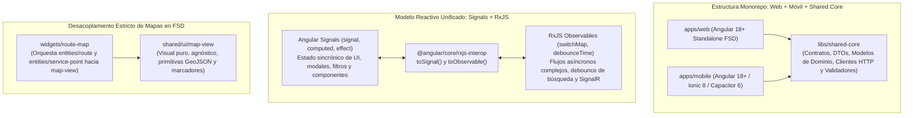

# Frontend y componentes

Este documento define la arquitectura técnica del frontend de IstpetDev para la aplicación web administrativa y la aplicación móvil del conductor/receptor, estableciendo los estándares de reactividad, estructura monorepo, desacoplamiento de componentes y optimización de rendimiento.



---

## 1. Stack Tecnológico y Versiones Oficiales

| Herramienta | Versión | Rol Arquitectónico |
|---|---|---|
| **Node.js** | `22 LTS` | Entorno de ejecución de herramientas de build y scripts. |
| **Angular** | `18+` (Standalone) | Framework web base; componentes standalone sin NgModules (*Zoneless-ready*). |
| **Ionic / Capacitor** | `Ionic 8` / `Capacitor 6` | Framework para experiencia móvil y empaquetado PWA/nativo offline. |
| **Tailwind CSS** | `3.4+` | Sistema de diseño de utilidades CSS estandarizado con tema personalizado. |
| **TypeScript** | `5.4+` | Tipado estricto (`strict: true`) en todo el frontend. |
| **Librería de Mapas** | `Mapbox GL JS` / `Leaflet` | Renderizado cartográfico vectorial acelerado por hardware. |

---

## 2. Shared Core (`libs/shared-core`): Cero Código Duplicado

Para evitar la duplicación de tipos, validaciones y clientes entre `apps/web` y `apps/mobile`:

```text
libs/shared-core/src/
  contracts/            DTOs de petición y respuesta (/api/v1)
    inventory.dto.ts
    routes.dto.ts
    delivery.dto.ts
    risk.dto.ts
  models/               Entidades puras e interfaces de dominio
    service-point.model.ts
    lot.model.ts
    handling-unit.model.ts
  units/                Utilidades de conversión estricta (L, kg, cajas)
    volume-converter.ts
    weight-converter.ts
  validation/           Esquemas de validación comunes y reglas invariantes
    idempotency.validator.ts
```

Tanto el panel web como la app móvil importan directamente desde `@istpetdev/shared-core`, asegurando consistencia de contratos cuando la API evoluciona.

---

## 3. Modelo Reactivo Unificado: Angular Signals + RxJS

Se establece una división de responsabilidades estricta entre **Signals** y **RxJS** para maximizar rendimiento y eliminar fugas de memoria:

### 3.1 Angular Signals para Estado Local y UI
* Todo el estado sincrónico de componentes se gestiona mediante Signals:
  ```typescript
  // Estado local reactivo
  readonly selectedPointId = signal<string | null>(null);
  readonly filterSeverity = signal<'TODOS' | 'CRITICO' | 'ALERTA'>('TODOS');

  // Valores derivados computados (cero subscripciones manuales)
  readonly criticalRisks = computed(() => 
    this.risks().filter(r => r.coverageDays <= r.thresholdDays)
  );
  ```
* Uso mandatorio de las nuevas APIs de Angular:
  * `input()` y `input.required()` en lugar de `@Input()`.
  * `output()` en lugar de `@Output()`.
  * `model()` para enlace bidireccional limpio.

### 3.2 RxJS para Flujos Asíncronos Complejos
* Reservado exclusivamente para:
  1. *Debounce* y cancelación en inputs de búsqueda de puntos logísticos (`debounceTime(300)`, `distinctUntilChanged()`, `switchMap()`).
  2. Recepción de eventos en tiempo real desde WebSockets de SignalR.
  3. Temporizadores de actualización y reintentos exponenciales.
* Conexión entre ambos mundos mediante `@angular/core/rxjs-interop`:
  ```typescript
  // Convertir canal SignalR o HTTP a Signal para consumo directo en el template
  readonly activeIncident = toSignal(this.signalRService.incidentStream$, { initialValue: null });
  ```

---

## 4. Desacoplamiento del Visor de Mapas en FSD

Para evitar que las librerías cartográficas ensucien la lógica de negocio:

1. **Componente Visual Agnóstico (`shared/ui/map-view`):**
   * Es puramente declarativo. No conoce conceptos de logística, hospitales ni inventario.
   * Entradas (*Inputs*):
     * `center = input<[number, number]>([-0.1807, -78.4678])` (Quito)
     * `zoom = input<number>(7)`
     * `markers = input<MapMarkerDto[]>()`
     * `routeGeoJson = input<GeoJSON.FeatureCollection | null>()`
   * Salidas (*Outputs*):
     * `markerClicked = output<string>()` (emite solo el ID del marcador).
2. **Widget de Orquestación (`widgets/route-map`):**
   * Consume `entities/route` y `entities/service-point`.
   * Transforma las paradas y el recorrido calculado en primitivas visuales para `map-view`.
   * Permite alternar la comparativa visual entre **Ruta Tradicional (Baseline)** y **Ruta Optimizada IstpetDev**.

---

## 5. Optimización de la Consulta Pública QR para el Jurado (`/trace/:id`)

El flujo del jurado requiere escanear un QR físico y ver la trazabilidad de la caja en su teléfono en menos de **1.5 segundos**:

1. **Aislamiento por Chunk (Lazy Loading Estricto):**
   * La página `pages/public-trace` se compila en un bundle independiente que no importa librerías pesadas (Mapbox, ApexCharts, SignalR o servicios administrativos).
   * Tamaño objetivo del bundle: **< 150 KB gzip**.
2. **Diseño Visual de Solo Lectura:**
   * Muestra la línea de tiempo de custodia (Bodega → Despacho → En tránsito → Recepción) con estado verificado.
   * Oculta datos privados (sin firmas completas, números telefónicos o coordenadas sensibles de la flota).
   * Funciona perfectamente sin requerir autenticación ni inicio de sesión.

---

## 6. Autorización RBAC en Cliente (ADR-14)

Para reflejar la matriz de permisos de servidor descrita en [[Seguridad y evidencias]]:

### 6.1 Directiva Estructural `*hasPermission`
Permite ocultar o mostrar controles de forma reactiva según las acciones autorizadas del usuario:
```html
<!-- Solo visible para usuarios con permiso de publicar rutas -->
<button *hasPermission="'ROUTE_PUBLISH'" (click)="publishRoute()" class="btn-primary">
  Publicar Ruta Operativa
</button>
```

### 6.2 Guards Funcionales de Ruta
```typescript
export const roleGuard = (allowedRoles: UserRole[]): CanActivateFn => {
  return () => {
    const authService = inject(AuthService);
    const router = inject(Router);
    return authService.hasAnyRole(allowedRoles) ? true : router.parseUrl('/unauthorized');
  };
};
```
> [!NOTE]
> La directiva y los guards orientan la navegación del usuario en el cliente, pero **el backend rechaza transaccionalmente cualquier comando o consulta no autorizada**, garantizando seguridad real independientemente del estado del frontend.

---

## 7. Pantallas Principales del Sistema

| Pantalla | Capa FSD | Responsabilidad Clave |
|---|---|---|
| **Resumen Operativo** | `pages/operations-dashboard` | Matriz de puntos críticos, cálculo de cobertura en días y alertas explicadas. |
| **Planificación de Rutas** | `pages/route-planning` | Comparación de rutas baseline vs optimizada, restricciones viales y aprobación. |
| **Gestión de Inventario** | `pages/inventory` | Saldo disponible, reservas, lotes con vencimiento y registro de movimientos. |
| **Detalle de Entrega y Custodia** | `pages/delivery-detail` | Línea de tiempo de la unidad QR, conciliación de líneas y evidencias fotográficas. |
| **Simulador y Métricas** | `pages/simulation` | Ejecución de escenarios de 90 días, comparación de KPIs y exportación reproducible. |
| **Consulta Pública QR** | `pages/public-trace` | Página ultra-ligera y pública para lectura del pasaporte logístico por el jurado. |

Referencias internas: [[Frontend con Feature-Sliced Design]], [[Movil offline y sincronizacion]], [[Contratos API y eventos]], [[Seguridad y evidencias]].

## Versiones y entornos concretados — 7 de octubre de 2026

Bryan fija **Angular 22** y .NET 8. Se conservan Signals/RxJS, standalone, FSD, shared-core, mapas desacoplados y QR ligero. Versiones verificadas y selección de Ionic/Tailwind/Capacitor: [[Repositorio de software y versiones]]. Angular 22 requiere TypeScript 6.0 compatible; la tabla anterior es la base recibida, este complemento concreta la implementación posterior.

Cada integrante ejecuta web/móvil localmente; la autenticación usa Cognito según [[Identidad OIDC y sesiones]]. Configuración frontend solo pública; no distribuir `.env` backend ni secretos. Compatibilidad de componentes/dispositivos y presupuestos de bundle todavía debe probarse. Dominio HTTPS institucional continúa pendiente de profundización del compañero.
