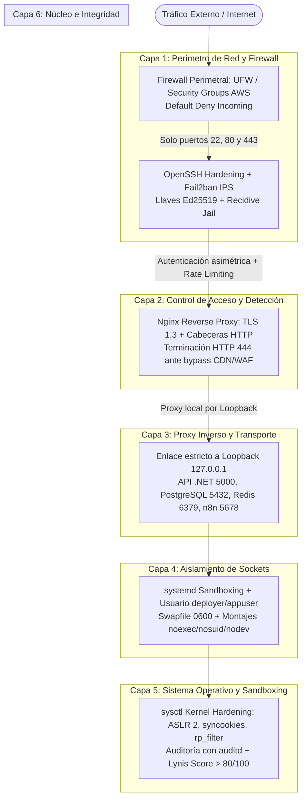

# Hardening y seguridad de servidores

Este documento define el estándar técnico de blindaje (*hardening*), aseguramiento perimetral, aislamiento de procesos y gestión de acceso para los servidores Linux de IstpetDev en el marco del Reto 1 de la Hackathon Expo Clean 2026.

Su propósito es garantizar una postura de **Defensa en Profundidad de 6 Capas**, eliminando dependencias de controles únicos y protegiendo la API en .NET 8, la aplicación web/móvil, PostgreSQL con PostGIS, Redis y los flujos de n8n.



---

## 1. Capa 1: Perímetro de Red y Firewall

La política obligatoria del host es **Default Deny Incoming** (denegar todo el tráfico entrante salvo puertos autorizados expresamente).

### 1.1 Reglas de Firewall con UFW (Ubuntu / Debian)

```bash
# 1. Definir políticas por defecto
sudo ufw default deny incoming
sudo ufw default allow outgoing
sudo ufw default deny routed

# 2. Permitir SSH administrativo con rate limiting preventivo
sudo ufw limit 22/tcp comment 'SSH Administrativo con Rate Limit'

# 3. Permitir tráfico web público únicamente hacia el Proxy Inverso (Nginx)
sudo ufw allow 80/tcp comment 'HTTP Nginx LetEncrypt / Redireccion'
sudo ufw allow 443/tcp comment 'HTTPS Nginx Proxy Inverso'

# 4. Activar firewall
sudo ufw enable
sudo ufw status verbose
```

> [!NOTE]
> En Debian y Ubuntu modernos, el servicio systemd `ufw` tiene la directiva `Type=oneshot`. Aplica las reglas en el backend de `nftables`/`iptables` durante el arranque y finaliza. Que `systemctl status ufw` reporte `inactive` es normal; las reglas permanecen activas en el kernel y se verifican mediante `sudo ufw status` o `sudo iptables -L -n`.

### 1.2 Mitigación Crítica: La Trampa de Docker con iptables

Por defecto, el daemon de Docker manipula directamente las tablas de `iptables` insertando reglas en la cadena `PREROUTING`. Si un contenedor se publica como `-p 5000:5000` o `-p 5432:5432`, **el puerto queda expuesto a todo internet ignorando las reglas de UFW**.

#### Regla Mandatoria para Docker y docker-compose.yml:
Todo puerto de servicio interno (API .NET, PostgreSQL, Redis, n8n) debe publicarse **estrictamente en la interfaz loopback `127.0.0.1`**:

```yaml
# Correcto: inaccesible desde internet, solo consumible por Nginx local o localhost
ports:
  - "127.0.0.1:5000:5000"  # API C# / .NET 8
  - "127.0.0.1:5432:5432"  # PostgreSQL PostGIS
  - "127.0.0.1:6379:6379"  # Redis
  - "127.0.0.1:5678:5678"  # n8n

# INCORRECTO Y PROHIBIDO (Bypass silencioso de firewall):
# ports:
#   - "5000:5000"
#   - "5432:5432"
```

Los servicios que solo se comunican entre sí (ej. API hacia PostgreSQL o Redis) deben utilizar redes internas de Docker tipo `bridge` sin publicar puertos al host anfitrión siempre que sea posible.

---

## 2. Capa 2: Control de Acceso y Detección de Intrusiones (SSH + Fail2ban)

### 2.1 Criptografía y Hardening de OpenSSH

Se prohíbe el acceso directo como `root` y la autenticación mediante contraseña. Se exige el estándar criptográfico **Ed25519** generado con alto número de rondas KDF (`ssh-keygen -o -a 100 -t ed25519`).

Configuración modular en `/etc/ssh/sshd_config.d/99-hardening.conf`:

```text
# 1. Autenticación y Restricción de Cuentas
PermitRootLogin no
PasswordAuthentication no
PubkeyAuthentication yes
KbdInteractiveAuthentication no
AuthenticationMethods publickey

# 2. Límites de Conexión y Tiempos de Gracia
MaxAuthTries 3
LoginGraceTime 30
MaxSessions 2
ClientAliveInterval 300
ClientAliveCountMax 2

# 3. Desactivación de Vectores Innecesarios
X11Forwarding no
AllowTcpForwarding no
AllowAgentForwarding no
PermitUserEnvironment no
PermitTunnel no

# 4. Ofuscación de Información del Sistema
DebianBanner no
PrintMotd no
PrintLastLog yes
LogLevel VERBOSE

# 5. Algoritmos Criptográficos y Ciphers Modernos (Exclusión de CBC, SHA1 y 3DES)
KexAlgorithms curve25519-sha256,curve25519-sha256@libssh.org,diffie-hellman-group16-sha512,diffie-hellman-group18-sha512
Ciphers chacha20-poly1305@openssh.com,aes256-gcm@openssh.com,aes128-gcm@openssh.com
MACs hmac-sha2-512-etm@openssh.com,hmac-sha2-256-etm@openssh.com
```

Validación antes de recargar:
```bash
sudo sshd -t
sudo systemctl reload ssh || sudo systemctl reload sshd
```

### 2.2 Sistema de Prevención de Intrusiones con Fail2ban

Configuración en `/etc/fail2ban/jail.local`:

```ini
[DEFAULT]
ignoreip = 127.0.0.1/8 ::1
bantime  = 3600
findtime = 600
maxretry = 5
backend  = systemd
bantime.increment = true
bantime.factor = 2
bantime.maxtime = 604800

[sshd]
enabled  = true
port     = ssh
logpath  = %(sshd_log)s
maxretry = 3

[recidive]
enabled   = true
logpath   = /var/log/fail2ban.log
banaction = %(banaction_allports)s
bantime   = 604800
findtime  = 86400
maxretry  = 3
```

---

## 3. Capa 3: Proxy Inverso, TLS y Seguridad en Capa 7 (Nginx)

Nginx actúa como el único punto de contacto público expuesto a internet. Gestiona la terminación TLS, el filtrado de tráfico, la compresión, los WebSockets de SignalR y la protección del navegador.

### 3.1 Parámetros Globales de Seguridad (`/etc/nginx/conf.d/security.conf`)

```nginx
# 1. Ocultar versión del servidor web
server_tokens off;

# 2. Protocolos TLS modernos (Excluir SSLv3, TLS 1.0 y TLS 1.1)
ssl_protocols TLSv1.2 TLSv1.3;
ssl_prefer_server_ciphers on;
ssl_ciphers ECDHE-ECDSA-AES128-GCM-SHA256:ECDHE-RSA-AES128-GCM-SHA256:ECDHE-ECDSA-AES256-GCM-SHA384:ECDHE-RSA-AES256-GCM-SHA384:DHE-RSA-AES128-GCM-SHA256:DHE-RSA-AES256-GCM-SHA384;

# 3. Optimización de sesiones y OCSP Stapling
ssl_session_timeout 1d;
ssl_session_cache shared:SSL:10m;
ssl_session_tickets off;
ssl_stapling on;
ssl_stapling_verify on;
resolver 1.1.1.1 8.8.8.8 valid=300s;
resolver_timeout 5s;

# 4. Rate Limiting en memoria compartida (Anti-DDoS y Fuerza Bruta)
limit_req_zone $binary_remote_addr zone=api_req_limit:10m rate=30r/s;
limit_conn_zone $binary_remote_addr zone=global_conn_limit:10m;
limit_req_status 429;
limit_conn_status 429;

# 5. Cabeceras HTTP de Seguridad
add_header X-Frame-Options "SAMEORIGIN" always;
add_header X-Content-Type-Options "nosniff" always;
add_header Referrer-Policy "strict-origin-when-cross-origin" always;
add_header Permissions-Policy "geolocation=(), microphone=(), camera=(self), payment=()" always;
add_header Cross-Origin-Opener-Policy "same-origin" always;
add_header Strict-Transport-Security "max-age=63072000; includeSubDomains; preload" always;

# 6. Mitigación de Buffer Overflow y Slowloris
client_body_buffer_size 128k;
client_max_body_size 15M;
client_header_buffer_size 1k;
large_client_header_buffers 4 4k;
client_body_timeout 10s;
client_header_timeout 10s;
keepalive_timeout 30s;
send_timeout 10s;
```

### 3.2 Protección de Origen y Cierre Inmediato TCP (HTTP 444)

Para mitigar escaneos automatizados de Shodan, Censys y atacantes que intentan golpear la IP pública saltándose Cloudflare o el CDN:
1. Validar mTLS de origen con el certificado CA del CDN.
2. Si la petición no presenta el certificado legítimo o evade el dominio, terminar la conexión TCP sin respuesta (`return 444;`).
3. Restaurar la IP real del cliente mediante `real_ip_header` para que el rate limiting y los logs auditen al usuario real.

```nginx
server {
    listen 443 ssl http2;
    listen [::]:443 ssl http2;
    server_name api.istpetdev.com;

    ssl_certificate /etc/ssl/certs/istpetdev_server.crt;
    ssl_certificate_key /etc/ssl/private/istpetdev_server.key;

    # Opcional mTLS con CDN
    # ssl_client_certificate /etc/ssl/certs/cdn_ca.crt;
    # ssl_verify_client on;
    # error_page 496 =444 @cerrar_conexion;
    # location @cerrar_conexion { return 444; }

    # Rate limit aplicado a endpoints de API
    limit_req zone=api_req_limit burst=50 nodelay;

    # Proxy a Kestrel (.NET 8 Web API en Loopback)
    location /api/ {
        proxy_pass http://127.0.0.1:5000;
        proxy_http_version 1.1;
        proxy_set_header Host $host;
        proxy_set_header X-Real-IP $remote_addr;
        proxy_set_header X-Forwarded-For $proxy_add_x_forwarded_for;
        proxy_set_header X-Forwarded-Proto $scheme;
    }

    # Soporte para WebSockets de SignalR (Alertas y Chat)
    location /hubs/ {
        proxy_pass http://127.0.0.1:5000;
        proxy_http_version 1.1;
        proxy_set_header Upgrade $http_upgrade;
        proxy_set_header Connection "upgrade";
        proxy_set_header Host $host;
        proxy_set_header X-Real-IP $remote_addr;
        proxy_set_header X-Forwarded-For $proxy_add_x_forwarded_for;
        proxy_set_header X-Forwarded-Proto $scheme;
        proxy_read_timeout 300s;
    }
}
```

---

## 4. Capa 4: Aislamiento de Sockets y Enlace Loopback (Loopback Binding)

Ningún proceso de backend, microservicio, base de datos o worker debe escuchar en la interfaz comodín `0.0.0.0` (o `::`).

| Servicio / Runtime | Parámetro de Configuración | Enlace Seguro |
|---|---|---|
| **C# / .NET 8 (Kestrel)** | Variable `ASPNETCORE_URLS` o `appsettings.json` | `http://127.0.0.1:5000` |
| **PostgreSQL 16+** | `postgresql.conf` | `listen_addresses = 'localhost'` |
| **Redis 7** | `redis.conf` | `bind 127.0.0.1 -::1` y `protected-mode yes` |
| **n8n** | Variables de entorno | `N8N_HOST=127.0.0.1` y `N8N_PORT=5678` |

---

## 5. Capa 5: Sistema Operativo, Sandboxing y Gestión de Memoria

### 5.1 Cuentas No Privilegiadas y Mínimo Privilegio (POLP)
* Usuario operativo para CI/CD y despliegue: `deployer`, miembro del grupo `sudo`.
* Usuario de sistema para runtimes de aplicación: `appuser`, creado con `--system --no-create-home --shell /usr/sbin/nologin`.
* Sudoers restrictivo en `/etc/sudoers.d/01-security-hardening` (`use_pty`, `logfile="/var/log/sudo.log"`, `passwd_tries=3`, `timestamp_timeout=15`, `tty_tickets`).
* `umask 027` por defecto en `/etc/login.defs` y `/etc/profile.d/umask.sh`.

### 5.2 Memoria de Intercambio (Swapfile) Endurecida
En servidores con memoria limitada (ej. instancias EC2 `t3.small` o `t3.medium`), el swapfile evita fallos por OOM (Out Of Memory) durante compilaciones o ráfagas. Sin embargo, puede contener volcados de memoria en texto plano con tokens o claves privadas:
```bash
# Crear swap de 2GB
sudo fallocate -l 2G /swapfile || sudo dd if=/dev/zero of=/swapfile bs=1M count=2048
sudo chmod 600 /swapfile  # Permiso obligatorio: solo root
sudo mkswap /swapfile
sudo swapon /swapfile
echo '/swapfile none swap sw 0 0' | sudo tee -a /etc/fstab
```

### 5.3 Particionado Seguro en `/etc/fstab`
Montar `/tmp` y `/dev/shm` como `tmpfs` con banderas `noexec, nosuid, nodev` para impedir que un atacante descargue y ejecute binarios maliciosos desde directorios compartidos:
```text
tmpfs   /tmp        tmpfs   defaults,noexec,nosuid,nodev,size=1G   0 0
tmpfs   /dev/shm    tmpfs   defaults,noexec,nosuid,nodev           0 0
```

### 5.4 Sandboxing de Procesos con systemd
Si algún servicio se ejecuta directamente como unidad systemd (ej. worker de outbox o agente local), aplicar directivas de sandboxing estricto:
```ini
[Service]
User=appuser
Group=appuser
NoNewPrivileges=yes
ProtectSystem=strict
ProtectHome=yes
PrivateTmp=yes
PrivateDevices=yes
ProtectKernelTunables=yes
ProtectKernelModules=yes
ProtectControlGroups=yes
MemoryDenyWriteExecute=yes
CapabilityBoundingSet=
AmbientCapabilities=
ReadWritePaths=/var/www/istpetdev/logs /var/www/istpetdev/data
```

### 5.5 Saneamiento Automatizado de Contenedores y Procesos Zombies
Para mitigar la acumulación de contenedores parados o procesos huérfanos tras fallos OOM o despliegues sucesivos, programar un cron o timer systemd:
```bash
# Limpiar contenedores parados con más de 2 horas de inactividad
docker container prune -f --filter "until=2h"
# Liberar espacio de journald
sudo journalctl --vacuum-size=50M
```

---

## 6. Capa 6: Endurecimiento de Kernel (sysctl) y Auditoría

### 6.1 Parámetros de Seguridad en `/etc/sysctl.d/99-security-hardening.conf`

```ini
# 1. Mitigación DoS y SYN Flood
net.ipv4.tcp_syncookies = 1

# 2. Reverse Path Filtering (Anti-Spoofing de IP)
net.ipv4.conf.all.rp_filter = 1
net.ipv4.conf.default.rp_filter = 1

# 3. Desactivación de Source Routing y Redirecciones ICMP (Anti-MITM)
net.ipv4.conf.all.accept_source_route = 0
net.ipv4.conf.default.accept_source_route = 0
net.ipv4.conf.all.accept_redirects = 0
net.ipv4.conf.default.accept_redirects = 0
net.ipv4.conf.all.send_redirects = 0
net.ipv4.conf.default.send_redirects = 0

# 4. Ignorar paquetes broadcast (Anti-Smurf) y registrar paquetes marcianos
net.ipv4.icmp_echo_ignore_broadcasts = 1
net.ipv4.conf.all.log_martians = 1
net.ipv4.conf.default.log_martians = 1

# 5. Deshabilitar TCP Timestamps (Evita inferencia de uptime)
net.ipv4.tcp_timestamps = 0

# 6. Protección de Enlaces Simbólicos y FIFOs
fs.protected_symlinks = 1
fs.protected_hardlinks = 1
fs.protected_fifos = 2
fs.protected_regular = 2
fs.suid_dumpable = 0

# 7. ASLR Completo y Protección del Kernel
kernel.randomize_va_space = 2
kernel.kptr_restrict = 2
kernel.dmesg_restrict = 1
kernel.yama.ptrace_scope = 2
kernel.sysrq = 0
kernel.unprivileged_bpf_disabled = 1
net.core.bpf_jit_harden = 2

# 8. Swappiness balanceado
vm.swappiness = 10
```

Aplicación inmediata:
```bash
sudo sysctl --system
```

### 6.2 Auditoría y Lynis Benchmark
* `auditd` monitorea modificaciones en `/etc/passwd`, `/etc/shadow`, `/etc/sudoers.d/` y `/etc/ssh/`.
* Se establece como requisito de calidad de infraestructura alcanzar una puntuación **Lynis Hardening Index > 80/100** ejecutando:
  ```bash
  sudo lynis audit system --quick
  ```

---

## 7. Matriz de Verificación Post-Hardening

| Control de Seguridad | Comando de Verificación | Resultado Esperado |
|---|---|---|
| **Puertos Públicos** | `sudo ss -tulpn` | Solo `22` (SSH), `80` (HTTP) y `443` (HTTPS) en `0.0.0.0` o `::`. |
| **Sockets en Loopback** | `ss -tulpn \| grep -E "5000\|5432\|6379\|5678"` | Muestra exclusivamente `127.0.0.1` o `[::1]`. |
| **Firewall Perimetral** | `sudo ufw status verbose` | `Status: active`, `Default: deny (incoming)`. |
| **Fail2ban IPS** | `sudo fail2ban-client status sshd` | Jail `sshd` activa detectando fallos. |
| **SSH Root Deshabilitado** | `sudo sshd -T \| grep permitrootlogin` | `permitrootlogin no`. |
| **SSH Passwords Deshabilitados** | `sudo sshd -T \| grep passwordauthentication` | `passwordauthentication no`. |
| **ASLR del Kernel** | `cat /proc/sys/kernel/randomize_va_space` | Retorna `2`. |
| **Protección SYN Flood** | `cat /proc/sys/net/ipv4/tcp_syncookies` | Retorna `1`. |
| **Anti-Spoofing de Red** | `cat /proc/sys/net/ipv4/conf/all/rp_filter` | Retorna `1`. |
| **Permisos de Secretos (.env)** | `find /var/www -name ".env*" -ls` | Permisos `-rw-------` (`0600`) propiedad de `deployer`. |
| **Particiones Seguras** | `mount \| grep -E "/tmp\|/dev/shm"` | Presencia de opciones `noexec`, `nosuid` y `nodev`. |
| **Banners de Nginx Ocultos** | `curl -I https://localhost -k` | No expone versión en `Server: nginx`. |
| **Índice Lynis** | `sudo lynis audit system --quick` | **Puntuación > 80/100**. |

---

## 8. Seguridad en el Ciclo CI/CD

1. **Cero IPs de producción ni credenciales en Git:** Prohibido versionar IPs públicas, passwords o llaves privadas en commits, documentación o issues. Emplear siempre marcadores `<IP_SERVIDOR>`, `<DB_PASSWORD>`.
2. **Compilación en Runner (GitHub Actions):** Nunca compilar artefactos en el servidor anfitrión. Compilar imágenes en GitHub Actions (`buildx`) y transferir imágenes inmutables vía GHCR o artefactos compilados por SSH.
3. **Rotación ante Fuga Accidental:** Si una IP pública se filtra en GitHub, la medida obligatoria es rotar la Elastic IP en AWS, actualizar el DNS y actualizar los secrets en GitHub Actions.

Referencias internas: [[AWS y Terraform]], [[CI-CD y automatizacion de despliegue]], [[Seguridad y evidencias]].
