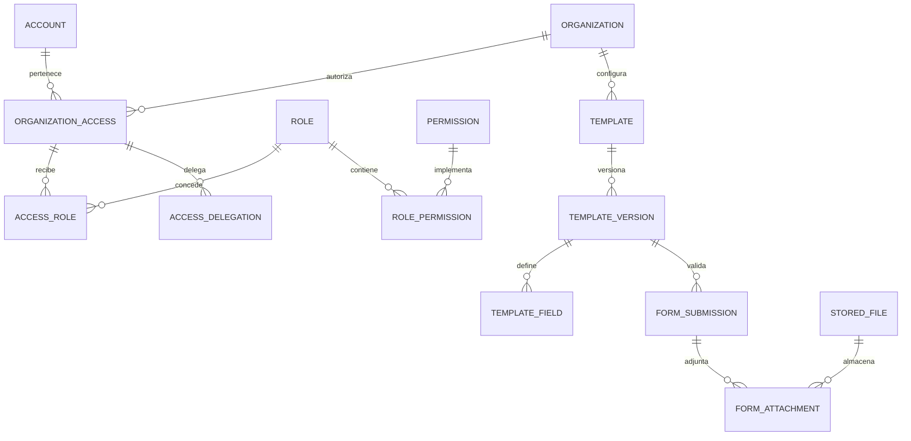

# Esquema completo de base de datos

Diseño objetivo para cubrir el sistema de [[Requisitos y aceptacion]], incluidos RBAC administrable y plantillas gestionadas desde la base. Bryan pidió esta ampliación el 9 de octubre; ADR-16 registra la decisión. Es una propuesta de esquema para convertir en migraciones, no una base ya creada ni una afirmación de que todas las funcionalidades están implementadas. Complementa [[Modelo de datos]] y sustituye su catálogo fijo de roles mediante [[RBAC y configuracion del sistema]].

## Infraestructura y estado comprobado

Se conserva la infraestructura documentada en [[AWS temporal para la hackathon y cierre]]: RDS PostgreSQL 16 privado con PostGIS, nodo EC2 de acceso SSM, Secrets Manager, S3 privado, Cognito y respaldos. Los datos operativos pertenecen a PostgreSQL; los archivos a S3; las identidades y contraseñas de inicio de sesión a Cognito. n8n mantiene su almacenamiento independiente.

Cada integrante trabaja en su base personal; integración recibe migraciones revisadas de `develop`. Para Bryan la base es `istpetdev_dev_01`, con `migrator_dev_01` para migraciones y `user_dev_01` para datos/API. Conexión e inspección: [[Conexion PostgreSQL en DBeaver]]. Una base personal puede contener dos organizaciones sintéticas para probar aislamiento: base por desarrollador y organización por operación son límites diferentes.

La revisión local del repositorio de software del 9 de octubre encontró solamente cinco entidades operativas y la migración `20261008131600_InitialSchema`: `Products`, `ServicePoints`, `InventoryItems`, `Deliveries`, `RiskAssessments`. No se consultó RDS en esa revisión. La existencia de la migración en disco no prueba su aplicación. Este diseño amplía esa base; no borrar la migración inicial ni tratar esas cinco tablas como el sistema completo.

## Convenciones físicas compartidas

- Los nombres de tabla propuestos son los nombres canónicos singulares de las filas siguientes, con columnas PascalCase y mapeo EF explícito. Las tablas plurales existentes se conservan hasta una migración de transición revisada; no habrá dos tablas equivalentes en paralelo.
- `Id uuid` es PK, generado como UUID v7 por la aplicación. PostgreSQL 16 no aporta `uuidv7()`. `CreatedAtUtc timestamptz` se fija en servidor. Tablas mutables llevan `UpdatedAtUtc`, `Version bigint` y control de concurrencia; tablas de historial conservan actor, motivo y fecha de registro, con correcciones compensatorias.
- **T** indica tabla perteneciente a organización: `OrganizationId uuid NOT NULL`, FK a `Organization`, además de las columnas comunes. Cada una declara `UNIQUE (OrganizationId, Id)` para soportar FKs compuestas. **G** indica catálogo o identidad global; **R** indica raíz de organización. Su acceso se define en la sección RLS, no por asumir que G significa público.
- Toda referencia entre tablas T usa `(OrganizationId, ParentId) → (OrganizationId, Id)` y `ON DELETE RESTRICT` para historial operativo. Las referencias a catálogo G usan FK simple. Una FK por `Id` solamente no impide cruzar organizaciones. Tablas puente sin Id usarán PK compuesta explícita o mantendrán la convención de Id con `UNIQUE` de sus claves naturales.
- En las tablas, los nombres terminados en `Id` son FKs a la entidad nombrada, salvo identificadores externos declarados como texto. `AccountId`, `ActorAccountId` y `CreatedByAccountId` referencian `Account`. La presencia de una FK a Account no concede acceso operativo: además se exige membresía activa y ámbito.
- Excepciones explícitas: `OperationId` es UUID de operación, `CorrelationId` es identificador de trazado validado, `ClientId`/`ProviderExecutionId` son identificadores externos; AggregateId/ResourceId identifican agregados en eventos/auditoría, sin una FK polimórfica. Los alias TargetAccessId/RecipientAccessId referencian OrganizationAccess; FromStateId/ToStateId/StateId a WorkflowState; los alias de origen/destino/depósito/devolución a Location.
- Cantidades `numeric(18,4)`, dinero `numeric(18,2)`, peso/volumen `numeric(18,4)`, tasas/distancias `numeric(18,6)`. Una unidad base por SKU. `CHECK` de positividad/no negatividad según campo; los límites físicos son parámetros del producto, no constantes inventadas. Moneda explícita ISO 4217 en costos. Coordenadas `geography(Point,4326)`; geometrías lineales con SRID documentado.
- Códigos `varchar(64)`, nombres `varchar(200)`, comentarios con longitud máxima documentada en contrato. Estados/categorías usan catálogo o enumeración validada; no texto libre con valores desconocidos. Intervalos `FromUtc < ToUtc` y límites de tamaño de JSON/colecciones comprobados en API.
- JSONB guarda configuración validada, snapshots y formularios; no sustituye FKs de las relaciones de negocio. Cada payload tiene versión de esquema, límites y claves admitidas. Los campos que requieren unicidad, integridad o consulta estable siguen siendo columnas relacionales.
- Ninguna tabla guarda API keys, contraseñas de aplicación ni cadenas de conexión. `SecretReference` identifica una entrada autorizada del gestor, no su valor. Tokens QR solo se guardan como hash de un valor aleatorio de alta entropía.

## Identidad, organizaciones y RBAC

| Tabla | Ámbito | Columnas específicas | Relaciones, restricciones e índices |
|---|---|---|---|
| Organization | R | Code, Name, TimeZone, IsActive, AuthorizationVersion | Code único; raíz de todas las tablas T; TimeZone IANA validada; baja suspende acceso sin destruir historial |
| Account | G | Kind, Issuer, Subject, ClientId, DisplayName, IsActive | Identidad humana UNIQUE(Issuer, Subject); técnica UNIQUE(Issuer, ClientId), con índices parciales. CHECK de exclusión humano/técnico. Sin password ni token. Identidad externa inmutable |
| Permission | G | Code, ModuleCode, ActionCode, ResourceKind, IsDelegable | Code único, catálogo sincronizado por código/migración con operaciones realmente implementadas; no ejecuta comandos almacenados |
| FieldDefinition | G | EntityCode, FieldCode, DataType, IsServerControlled, Sensitivity | UNIQUE(EntityCode, FieldCode); identifica campos reales admitidos por DTO. Seguridad/identidad/saldos calculados no se vuelven editables por configuración |
| Role | T | Code, Name, Description, IsActive, IsSeed, IsTechnical | UNIQUE(OrganizationId, Code); baja revoca concesiones efectivas; roles iniciales descritos en [[Seguridad y evidencias]] |
| RolePermission | T | RoleId, PermissionId | UNIQUE(OrganizationId, RoleId, PermissionId); FK tenant a Role y global a Permission; cambios sujetos a delegación y auditoría |
| RoleFieldPermission | T | RoleId, FieldDefinitionId, CanRead, CanWrite | UNIQUE(OrganizationId, RoleId, FieldDefinitionId); escritura exige lectura y campo no controlado por servidor; aplica dentro de un permiso de acción, no lo reemplaza |
| OrganizationAccess | T | AccountId, IsActive, ValidFromUtc, ValidToUtc, GrantedByAccountId, RevokedAtUtc, Reason | UNIQUE(OrganizationId, AccountId); estado actual de membresía. Historial de cambios en RbacChange; no crear una membresía nueva para eludir una revocación |
| AccessRole | T | OrganizationAccessId, RoleId, GrantedByAccountId, RevokedAtUtc, Reason | UNIQUE activo por acceso/rol mediante índice parcial; membresía y rol deben estar activos. Historizar otorgamientos/revocaciones |
| AccessLocation | T | OrganizationAccessId, LocationId, GrantedByAccountId, RevokedAtUtc, Reason | UNIQUE activo por acceso/ubicación; limita almacén/vehículo/quarentena según tipo de Location |
| AccessServicePoint | T | OrganizationAccessId, ServicePointId, GrantedByAccountId, RevokedAtUtc, Reason | UNIQUE activo por acceso/punto; permiso de organización no implica acceso a cualquier punto |
| AccessDelegation | T | OrganizationAccessId, PermissionId, ScopeKind, LocationId, ServicePointId, CanDelegateFurther, ValidFromUtc, ValidToUtc, GrantedByAccountId, RevokedAtUtc, Reason | Techo de acciones/ámbitos que una cuenta puede otorgar sin poseerlas para ejecutarlas. FK tenant a acceso/ámbito, global a Permission; CHECK según scope; UNIQUE activo por acceso/permiso/ámbito con nulos tratados explícitamente. Bootstrap fija techo inicial; una gestión genérica de roles no lo amplía |
| RbacChange | T | ActorAccountId, TargetAccessId, TargetRoleId, ChangeKind, BeforeJson, AfterJson, Reason, CorrelationId | TargetAccessId FK a OrganizationAccess; TargetRoleId opcional FK a Role; solo inserción; cambios y aumento de AuthorizationVersion en una transacción; JSON redactado, sin credenciales |

## Configuración, catálogos, procesos y plantillas

| Tabla | Ámbito | Columnas específicas | Relaciones, restricciones e índices |
|---|---|---|---|
| ConfigurationDefinition | G | Code, ModuleCode, ValidationSchemaJson, Sensitivity, AllowedScopes | Code único; contrato de parámetros que la aplicación conoce. Límites y reglas protegidas definidos en servidor |
| ConfigurationVersion | T | ConfigurationDefinitionId, Revision, ValuesJson, ContentHash, PublishedAtUtc, CreatedByAccountId | UNIQUE(OrganizationId, ConfigurationDefinitionId, Revision); versión publicada inmutable; validación contra definición; snapshots operativos referencian la versión exacta |
| ConfigurationActivation | T | ConfigurationVersionId, ScopeKind, LocationId, ServicePointId, EffectiveFromUtc, EffectiveToUtc, ChangedByAccountId | CHECK: scope organización sin FKs locales, ubicación con LocationId o punto con ServicePointId. Sin intervalos superpuestos por definición/ámbito; activación validada transaccionalmente. Versiones de la misma definición |
| Catalog | T | Code, Name, ValueType, IsActive | UNIQUE(OrganizationId, Code); catálogos configurables de motivos/tipos/etiquetas sin sustituir enumeraciones de seguridad |
| CatalogOption | T | CatalogId, Code, Label, OrderNumber, IsActive, MetadataJson | UNIQUE(OrganizationId, CatalogId, Code); valores usados se desactivan en vez de borrarse; JSON de esquema conocido |
| WorkflowDefinition | T | Code, ModuleCode, Name, IsActive | UNIQUE(OrganizationId, Code); proceso sobre un módulo admitido por backend |
| WorkflowVersion | T | WorkflowDefinitionId, Revision, PublishedAtUtc, CreatedByAccountId, ContentHash | UNIQUE por definición/revisión; estados/transiciones se congelan al publicar; toda operación fija su versión |
| WorkflowState | T | WorkflowVersionId, Code, Label, IsInitial, IsTerminal | UNIQUE por versión/código; exactamente un estado inicial mediante validación de publicación; sin estados inaccesibles inadvertidos |
| WorkflowTransition | T | WorkflowVersionId, FromStateId, ToStateId, PermissionId, HandlerCode, ConditionJson | FKs compuestas para ambos estados en la misma versión; UNIQUE por versión/origen/destino/handler. HandlerCode y condiciones usan un vocabulario permitido, no SQL/C#/JavaScript libre |
| Template | T | Code, Kind, ModuleCode, Name, IsActive | UNIQUE(OrganizationId, Code); Kind: formulario, documento, etiqueta QR o prompt explicativo, con capacidades separadas |
| TemplateVersion | T | TemplateId, Revision, Status, ValidationSchemaJson, LayoutJson, ContentJson, ContentHash, WorkflowVersionId, PublishedAtUtc, CreatedByAccountId | UNIQUE por plantilla/revisión; publicación congela contenido/campos; estado draft/published/retired; esquema generado de campos para formularios. Sin scripts, SQL, URLs arbitrarias ni secretos |
| TemplateField | T | TemplateVersionId, Key, Label, DataType, IsRequired, OrderNumber, ValidationJson, VisibilityConditionJson, Sensitivity, CatalogId | UNIQUE por versión/key; tipos permitidos y límites de rango/longitud; condiciones declarativas; CatalogId opcional. Campo requiere revisión adicional si sensible |
| TemplateFieldOption | T | TemplateFieldId, Code, Label, OrderNumber, IsActive | UNIQUE por campo/code; opciones locales cuando no usa Catalog. Opciones se congelan con la versión |
| TemplateFieldAccess | T | RoleId, TemplateFieldId, CanRead, CanWrite | UNIQUE por rol/campo; permisos complementan acción/ámbito. Campos sensibles no se publican sin concesión explícita; administración de ACL no modifica contenido publicado |
| TemplateBinding | T | TemplateVersionId, ModuleCode, ActionCode, ScopeKind, LocationId, ServicePointId, EffectiveFromUtc, EffectiveToUtc | Resolución de plantilla por organización/módulo/acción/ámbito; CHECK de FKs según scope y no solapamiento. Solo versión publicada; activación auditada |
| FormSubmission | T | TemplateVersionId, SubmittedByAccountId, DataJson, SensitiveDataCiphertext, EncryptionKeyVersion, ContentHash, OperationId, SupersedesSubmissionId, DeliveryId, ReceiptId, ServicePointId, InventoryMovementId | FKs tenant concretas y a submission anterior; como máximo un contexto operativo por fila; formulario independiente permitido por contrato. UNIQUE(OrganizationId, SubmittedByAccountId, OperationId); datos validados con esa versión, sensibles separados del JSON indexable, aceptados inmutables y corregidos mediante otra submission ligada por SupersedesSubmissionId |
| FormAttachment | T | FormSubmissionId, StoredFileId, TemplateFieldId | Campo debe pertenecer a la misma versión que submission; UNIQUE por submission/archivo/campo; archivo confirmado y permitido para ese campo |

## Catálogo, puntos, ubicaciones y flota

| Tabla | Ámbito | Columnas específicas | Relaciones, restricciones e índices |
|---|---|---|---|
| ServicePoint | T | Code, Name, TypeOptionId, Position, Criticality, IsActive, ConfigurationVersionId | Code único por organización; TypeOptionId FK CatalogOption de catálogo permitido; índice GiST de Position; parámetros referencian definición apropiada |
| ServicePointWindow | T | ServicePointId, DayOfWeek, StartLocalTime, EndLocalTime, ValidFromDate, ValidToDate | CHECK día/rangos; zona horaria de organización; ventanas que cruzan medianoche se dividen explícitamente; evitar solapamientos |
| ServicePointContact | T | ServicePointId, DisplayNameCiphertext, PhoneCiphertext, EmailCiphertext, EncryptionKeyVersion | Información personal restringida; cifrado por campo según clasificación; sin devolverla en QR público |
| Location | T | Code, Kind, ServicePointId, VehicleId, Position, IsActive | Code único por organización; punto/almacén, vehículo y cuarentena con CHECK de referencia según Kind; VehicleId único cuando representa stock a bordo |
| Vehicle | T | Code, RegistrationCiphertext, MaxWeight, MaxVolume, IsActive | Code único por organización; capacidades positivas; identificación sensible restringida |
| VehicleAvailability | T | VehicleId, AvailableFromUtc, AvailableToUtc, DepotLocationId | Rango válido, depósito de tipo almacén; índice por vehículo/fecha; no solapamiento accidental |
| VehiclePosition | T | VehicleId, RoutePlanId, RecordedByAccountId, OccurredAtDevice, ReceivedAtServer, Position, OperationId | UNIQUE por organización/actor/OperationId; GiST/fecha; retención y precisión acotadas; pings en primer plano, no promesa de GPS en background |
| Product | T | Sku, Name, BaseUnit, WeightPerBaseUnit, VolumePerBaseUnit, IsActive | Sku único por organización; unidad canónica; peso/volumen no negativos; no mezclar L/kg/unidades |
| ProductUnitConversion | T | ProductId, PackagingCode, BaseQuantity | UNIQUE por producto/empaque; BaseQuantity positiva; cambio no altera conversiones ya capturadas en operaciones |
| Lot | T | ProductId, Code, Origin, ExpiresOn, ConditionOptionId, IsBlocked | UNIQUE por producto/código; bloqueo y vencimiento impiden disponibilidad; FK a opción del catálogo correcto; índice por producto/vencimiento |
| HandlingUnit | T | Code, LocationId, Status, SealedAtUtc | Code único por organización; ubicación actual conciliable con custodia/ledger; no equivale a un único lote |
| HandlingUnitLine | T | HandlingUnitId, LotId, Quantity | UNIQUE por unidad/lote; cantidad positiva; composición compatible con movimientos; impedir cambios de composición tras sello/despacho salvo operación compensatoria |

## Inventario, demanda y reabastecimiento

| Tabla | Ámbito | Columnas específicas | Relaciones, restricciones e índices |
|---|---|---|---|
| InventoryMovement | T | RecordedSequence, Kind, LotId, FromLocationId, ToLocationId, Quantity, ActorAccountId, OperationId, OccurredAtDevice, ReceivedAtServer, DeliveryLineId, ReceiptLineId, ConsumptionId, Reason | RecordedSequence bigint identity para corte de ledger, no orden inferido de UUID. Cantidad positiva; entrada externa solo destino, salida solo origen, transferencia ambos distintos. FKs al mismo lote/ámbito de líneas; UNIQUE de secuencia por organización; índice lote/ubicación/fecha; solo inserción |
| StockBalance | T | LocationId, LotId, QuantityOnHand, QuantityReserved, LastMovementSequence | UNIQUE por ubicación/lote; CHECK 0 ≤ reservado ≤ existencia; disponible = existencia − reservado, excluyendo lote bloqueado/vencido; actualización con ledger en un commit y control de versión |
| InventorySnapshot | T | CutoffUtc, LastMovementSequence, CreatedByAccountId, ContentHash | Corte consistente obtenido en transacción; inmutable; soporta cálculo y simulación sin leer estado posterior |
| InventorySnapshotLine | T | InventorySnapshotId, LocationId, LotId, QuantityOnHand, QuantityReserved, BalanceVersion, LotConditionCode, WasLotBlocked, LotExpiresOn | UNIQUE por snapshot/ubicación/lote; saldos no negativos; copia condición/bloqueo/vencimiento conocidos en ese corte para reproducir disponibilidad |
| Reservation | T | DeliveryLineId, LocationId, LotId, Quantity, ConsumedQuantity, ReleasedQuantity, Status | Cantidades ≥0 y consumido+liberado ≤ reservado; lote coincide con línea; índice por línea/estado; cancelación libera saldo reservado transaccionalmente |
| Consumption | T | ServicePointId, LotId, Quantity, SourceKind, ActorAccountId, OccurredAtDevice, ReceivedAtServer, OperationId | Cantidad positiva; fuente manual/sintética/importada identificada; UNIQUE por actor/operación; consumo confirmado produce movimiento sin doble efecto |
| DemandObservation | T | ServicePointId, ProductId, PeriodFromUtc, PeriodToUtc, RequestedQuantity, ObservedConsumption, SourceKind, RecordedAtUtc | Mantiene demanda aunque falte stock; cantidades no negativas; distingue observación real y sintética; UNIQUE por punto/producto/período/fuente; no sumar fuentes duplicadas |
| ReplenishmentRequest | T | ServicePointId, RequestedByAccountId, NeededByUtc, WorkflowVersionId, StateId, ConfigurationVersionId | StateId de esa versión; índice punto/estado/fecha; vincula parámetros usados sin recalcular histórico |
| ReplenishmentRequestLine | T | ReplenishmentRequestId, ProductId, RequestedQuantity, AllocatedQuantity | UNIQUE por solicitud/producto; 0 ≤ asignado ≤ solicitado; asignaciones acumuladas concurrentes validadas transaccionalmente |

## Rutas, entregas, recepción y evidencia

| Tabla | Ámbito | Columnas específicas | Relaciones, restricciones e índices |
|---|---|---|---|
| RoadMatrix | T | ProviderCode, DatasetVersionId, RequestedAtUtc, RetrievedAtUtc, ContentHash, ConfigurationVersionId | DatasetVersionId opcional FK ScenarioDatasetVersion; proveniencia y fecha; matriz externa o sintética identificada; inmutable |
| RoadMatrixEdge | T | RoadMatrixId, FromLocationId, ToLocationId, DistanceKm, DurationSeconds, IsReachable, UnreachableReason | UNIQUE por matriz/origen/destino; costos no negativos cuando alcanzable; no inventar distancia para par inaccesible |
| RoutePlan | T | Code, Revision, SupersedesRoutePlanId, VehicleId, RoadMatrixId, ConfigurationVersionId, WorkflowVersionId, StateId, PlannedStartUtc, PlannedEndUtc, PublishedByAccountId | UNIQUE por código/revisión; FK de versión anterior; tiempo/capacidad factibles; publicada inmutable en orden y asignaciones, nueva revisión conserva paradas ejecutadas |
| RoutePlanningSnapshot | T | RoutePlanId, InputJson, InputHash, AlgorithmCode, AlgorithmVersion, CutoffUtc | UNIQUE por plan; captura capacidades/disponibilidad, ventanas/zonas, parámetros y restricciones conocidos al calcular; inmutable y reproducible, sin datos futuros |
| RouteStop | T | RoutePlanId, ServicePointId, LocationId, SequenceNumber, PlannedArrivalUtc, PlannedDepartureUtc, ActualArrivalUtc, ActualDepartureUtc, Status, PendingReason | UNIQUE por ruta/secuencia; ambas referencias compatibles; índice punto/fecha; pendientes con motivo explícito, sin borrar lo ejecutado |
| Delivery | T | Code, RouteStopId, OriginLocationId, DestinationLocationId, ServicePointId, WorkflowVersionId, StateId, DispatchedAtUtc | Code único por organización; FK a parada y referencias consistentes; origen distinto de destino; índices ruta/punto/estado |
| DeliveryLine | T | DeliveryId, ReplenishmentRequestLineId, LotId, PlannedQuantity, DispatchedQuantity, AcceptedQuantity, RejectedQuantity, PackagingSnapshotJson | Cantidades ≥0; aceptado+rechazado ≤ despachado ≤ planificado; producto del lote coincide con solicitud; resultados acumulados solo mediante comandos transaccionales |
| DeliveryHandlingUnit | T | DeliveryId, HandlingUnitId, ReleasedAtUtc | UNIQUE activo por unidad/entrega; unidad no se despacha simultáneamente en dos entregas activas; verificar por bloqueo de HandlingUnit/índice parcial según contrato |
| DeliveryHandlingUnitLine | T | DeliveryHandlingUnitId, DeliveryLineId, HandlingUnitLineId, Quantity | FK de pertenencia unidad/línea y entrega/línea; mismo lote y organización; cantidad positiva. Asignación agregada no excede composición ni planificado; bloqueo transaccional de líneas |
| DeliveryAssignment | T | DeliveryId, OrganizationAccessId, AssignmentKind, AssignedByAccountId, AssignedAtUtc, RevokedAtUtc, Reason | AssignmentKind conductor/receptor; UNIQUE activo por entrega/acceso/tipo; membresía vigente; índice por acceso/entrega; autoridad del ámbito para cada acción |
| Receipt | T | DeliveryId, ActorAccountId, WorkflowVersionId, StateId, OperationId, OccurredAtDevice, ReceivedAtServer, AcceptedAtServer | UNIQUE por actor/operación; aceptación y movimiento en un commit; estado de recepción separado del estado de evidencia |
| ReceiptLine | T | ReceiptId, DeliveryLineId, QuantityAccepted, QuantityRejected, RejectionReasonOptionId, ReturnLocationId | UNIQUE por recibo/línea; aceptado+rechazado >0; misma entrega/lote; motivo y custodia de rechazo obligatorios cuando aplica. El límite entre varios recibos exige bloqueo de DeliveryLine |
| StoredFile | T | StorageKey, Kind, DeclaredMimeType, VerifiedMimeType, ByteSize, Sha256, Status, EncryptionKeyReference, CreatedByAccountId, ExpiresAtUtc | StorageKey único por organización, generado en servidor; sin URL pública permanente; estados pendiente/verificado/rechazado/retirado; solo archivos verificados descargables |
| Evidence | T | ReceiptId, ReceiptLineId, StoredFileId, Kind, UploadedByAccountId, ConfirmedAtUtc | FK a línea opcional que pertenezca al recibo; UNIQUE por recibo/archivo; foto/firma restringida y requerida según configuración capturada |
| CustodyEvent | T | HandlingUnitId, DeliveryId, ReceiptId, FromLocationId, ToLocationId, ActorAccountId, EventKind, OperationId, OccurredAtDevice, ReceivedAtServer | Solo inserción; relaciones/ubicaciones de misma organización; índice unidad/fecha; evento de escaneo no sustituye movimiento ni prueba entrega física |
| QrAccessToken | T | HandlingUnitId, TokenHash, ScopeCode, ExpiresAtUtc, RevokedAtUtc, CreatedByAccountId | TokenHash único, comparación de token sin guardarlo en claro; scope de resumen público; vencimiento/revocación; no abre acceso a StoredFile ni escritura |

## Riesgo, anomalías e integración

| Tabla | Ámbito | Columnas específicas | Relaciones, restricciones e índices |
|---|---|---|---|
| RiskCalculationRun | T | JobExecutionId, InventorySnapshotId, ConfigurationVersionId, FormulaCode, FormulaVersion, CutoffUtc, InputHash, Status | Ejecución determinista identificada; parámetros y stock fijados; solo observaciones conocidas hasta el corte |
| RiskSnapshot | T | RiskCalculationRunId, ServicePointId, ProductId, CoverageDays, LeadTimeDays, SafetyMarginDays, RiskCode, InputSnapshotJson, UncertaintyJson | UNIQUE por run/punto/producto; valores ausentes explícitos, no convertir consumo ausente en cero; inputs reproducibles, sin futuros; índice punto/producto/run, corte temporal en el run |
| RiskExplanation | T | RiskSnapshotId, IntegrationRunId, TemplateVersionId, ExplanationText, RecommendedAction, ProviderCode, ModelCode, Status | Prompt versionado; explicación validada o fallback. No cambia cifras/stock/riesgo oficial; índice snapshot/fecha |
| AnomalyCase | T | ServicePointId, ProductId, RiskSnapshotId, Status, DetectedAtUtc, ClosedByAccountId, Resolution, LossMovementId | LossMovementId FK InventoryMovement opcional; anomalía no equivale a merma. Confirmación de pérdida requiere conciliación/actor/motivo |
| Incident | T | ServicePointId, RoutePlanId, ReportedByAccountId, SeverityOptionId, Position, IsSynthetic, ScenarioEventId, Status, OccurredAtDevice, ReceivedAtServer | ScenarioEventId FK ScenarioEvent para demo; alcance de recursos comprobado; índice ruta/estado/fecha; sintético no se disfraza de real |
| IncidentRoadRestriction | T | IncidentId, RoadMatrixEdgeId, EffectiveFromUtc, EffectiveToUtc, IsClosed, AddedDurationSeconds | FK tenant a segmento de matriz; rango válido, duración adicional no negativa; identifica restricción, no solo marcador. No muta matriz histórica |
| RoutePlanIncident | T | RoutePlanId, IncidentId | UNIQUE por plan/incidente; incidentes considerados en esa revisión, con restricciones capturadas en RoutePlanningSnapshot |
| IntegrationConnection | T | Code, ProviderCode, EndpointReference, SecretReference, IsActive, ConfigurationVersionId | Code único; endpoint se resuelve contra allowlist administrada, evita SSRF; SecretReference solo referencia, no valor; habilitación no concede nuevas acciones técnicas |
| JobExecution | T | Kind, RequestedByAccountId, OperationId, Status, RequestedAtUtc, StartedAtUtc, CompletedAtUtc, Progress, ErrorCode | UNIQUE por solicitante/operación; listado/resultado hereda ámbito de solicitud; sin payloads sensibles en error; progreso acotado |
| IntegrationRun | T | IntegrationConnectionId, JobExecutionId, RunKey, ProviderExecutionId, Status, Attempts, TokenCount, EstimatedCost, Currency, ErrorCode | UNIQUE por conexión/RunKey; métricas/fallback/reintentos acotados; no registrar request headers con credenciales |

## Chat, notificaciones, sincronización y auditoría

| Tabla | Ámbito | Columnas específicas | Relaciones, restricciones e índices |
|---|---|---|---|
| Conversation | T | DeliveryId, RoutePlanId, CreatedByAccountId, Status | Contexto de entrega o ruta compatible; como máximo un contexto, conversación general permitida por contrato; índice de contexto |
| ConversationParticipant | T | ConversationId, OrganizationAccessId, JoinedAtUtc, RevokedAtUtc | UNIQUE activo por conversación/acceso; pertenencia vigente, aun con rol Gerencia; revocación retira acceso REST y SignalR |
| Message | T | ConversationId, AuthorAccountId, OperationId, BodyText, ReceivedAtServer, RedactedAtUtc | UNIQUE por autor/operación; texto escapado en UI; edición/retirada auditada; índice conversación/fecha/Id, sin almacenar HTML ejecutable |
| MessageAttachment | T | MessageId, StoredFileId | UNIQUE mensaje/archivo; mismo ámbito; archivo verificado; límites del contrato de chat |
| Notification | T | RecipientAccessId, EventType, PayloadJson, ReadAtUtc, SourceEventId | RecipientAccessId FK OrganizationAccess; SourceEventId opcional FK OutboxEvent; UNIQUE por destinatario/evento; payload mínimo y enlace reautorizado, no copia de evidencia privada |
| IdempotencyRecord | T | AccountId, OperationId, ActionCode, RequestHash, ResponseStatus, ResponseJson, CompletedAtUtc, RetainUntilUtc | UNIQUE(OrganizationId, AccountId, ActionCode, OperationId); respuesta limitada; no entregar replay sin permiso vigente; retención cubre ventana offline |
| OutboxEvent | T | EventType, SchemaVersion, AggregateId, AggregateType, AggregateVersion, PayloadJson, OccurredAtServer, PublishedAtUtc, Attempts | Referencia lógica al agregado mediante tipo admitido; no FK polimórfica para relaciones de negocio. Se crea en commit de operación; índice parcial pendientes; consumidor idempotente |
| AuditEvent | T | ActorAccountId, ActionCode, ResourceType, ResourceId, ResultCode, Reason, CorrelationId, BeforeJson, AfterJson, RecordedAtUtc | Historial solo inserción; ResourceId es referencia de auditoría histórica, no autoridad/FK operativa. Payload redactado; retención/exportación protegida; auditoría no es inmutable frente a administradores DB |
| SyncBatch | T | AccountId, DeviceReference, OperationId, ReceivedAtServer, Status | UNIQUE por cuenta/operación; dispositivo identifica origen, no concede rol; no duplica en servidor toda la cola local |
| SyncOperation | T | SyncBatchId, IdempotencyRecordId, ActionCode, ClientOccurredAt, ResultCode | UNIQUE por batch/registro; mismo actor y acción del registro; resultado/errores sin datos de otros ámbitos; orden validado por prerequisitos |

## Dataset y simulación

| Tabla | Ámbito | Columnas específicas | Relaciones, restricciones e índices |
|---|---|---|---|
| ScenarioDataset | T | Code, Name, IsSynthetic, Description | Code único; datos sintéticos etiquetados; contiene versiones, no sobrescribe dataset usado |
| ScenarioDatasetVersion | T | ScenarioDatasetId, Revision, Seed, ContentHash, ManifestJson, StoredFileId | UNIQUE por dataset/revisión; inmutable; manifiesto incluye unidades, obligaciones/recursos iniciales y cronología exógena; artifact privado |
| ScenarioEvent | T | ScenarioDatasetVersionId, SequenceNumber, SimulationTime, EventKind, PayloadJson | UNIQUE por versión/secuencia; evento de formato validado; calendario común para baseline y plataforma; no modifica operación real |
| SimulationPolicyVersion | T | Code, Revision, HandlerCode, ParametersJson, ContentHash, ConfigurationVersionId | UNIQUE por código/revisión; algoritmo implementado y parámetros admitidos; misma versión/hash permite reproducción |
| SimulationRun | T | JobExecutionId, ScenarioDatasetVersionId, SimulationPolicyVersionId, RoadMatrixId, Seed, StartedAtUtc, CompletedAtUtc, Status, InputHash | Una política por run; comparar runs con mismo dataset/seed/recursos/matriz/horizonte; baseline también produce registro durable |
| SimulationEvent | T | SimulationRunId, SequenceNumber, SimulationTime, EventKind, PayloadJson | UNIQUE por run/secuencia; ledger simulado separado del operativo; evento determinista y exportable |
| SimulationMetric | T | SimulationRunId, Code, DefinitionVersion, ProductId, Numerator, Denominator, Value, Unit, NotApplicableReason | UNIQUE por run/código/versión/SKU con índices separados para SKU nulo; denominador cero ⇒ Value nulo y razón; unidades no mezcladas |
| SimulationArtifact | T | SimulationRunId, StoredFileId, Kind, ContentHash | UNIQUE por run/kind; metrics.json, resumen, eventos y manifest con hashes; descargar exige permiso del run |

## Reglas transaccionales que requieren algo más que CHECK

Relaciones centrales de identidad y configuración (las tablas completas están en el catálogo anterior):

Un CHECK no debe consultar otras filas para imponer totales. Despacho, recepción y reserva usan una transacción con bloqueos o actualizaciones condicionales sobre `StockBalance`, `Reservation` y `DeliveryLine`; validan duplicados de negocio, insertan movimiento, actualizan proyección, guardan idempotencia y outbox antes del commit. La cantidad aceptada por varios recibos no puede exceder lo despachado. Un rechazo conserva stock/custodia a bordo o lo devuelve mediante movimiento explícito; no se cuenta simultáneamente como consumo y pérdida.

Una secuencia identity refleja asignación, no orden de commit. LastMovementSequence es referencia informativa del snapshot; no reconstruir un corte histórico solamente con `sequence <= máximo`. La copia consistente de saldos/condiciones e inputs visible en esa transacción es la evidencia del corte, con hash y versión. Si se necesita orden de commit de negocio, añadir un mecanismo transaccional explícito y probar concurrencia, sin inferirlo de UUID/identity.

Estados y transiciones fijan `WorkflowVersionId`, con FK compuesta a StateId de esa misma versión. Una transición configurable invoca un comando implementado que conserva esas invariantes. Evitar ciclos de insert con FKs diferibles solo cuando sean necesarios; por ejemplo, crear recibo/líneas y sus movimientos en el mismo commit. La combinación de plantilla, envío y sus campos se verifica con FKs de versión o validación transaccional, no con un CHECK que pretenda leer otras tablas.

Activaciones de configuración/plantilla se serializan por organización+clave+ámbito, validando intervalos antes de publicar. Puede emplearse exclusión GiST si se aprueba la extensión requerida; no dar por instalada `btree_gist`. Resolución determinista: punto → ubicación → organización, y error explícito si hay más de una candidata del mismo nivel.

## Aislamiento por fila y permisos de columnas

Las tablas T activan RLS y FORCE RLS mediante migración, con políticas SELECT/INSERT/UPDATE/DELETE y `USING`/`WITH CHECK`. El usuario API no es propietario, superusuario ni BYPASSRLS. Se verifica cada tabla, incluidas puentes, archivos, configuración, auditoría, outbox y simulación; habilitar RLS solo en Delivery no protege sus líneas. El propietario puede quedar sujeto a FORCE, pero superusuarios/BYPASSRLS lo evitan; TRUNCATE tampoco queda protegido por RLS. Estas limitaciones están documentadas en [PostgreSQL 16](https://www.postgresql.org/docs/16/ddl-rowsecurity.html).

La API deriva AccountId y OrganizationId de JWT+membresía, abre transacción y fija contexto con `set_config(..., true)` parametrizado. Ausencia de contexto deniega. Políticas de fila aplican organización y ámbito local: acceso a ubicación/punto, DeliveryAssignment o ConversationParticipant cuando corresponde. Las tablas R/Account tienen políticas específicas de raíz/membresía; catálogos G se leen de forma acotada y solo el migrador los modifica. Evitar ciclos de políticas entre Account, OrganizationAccess y sus puentes: el diseño SQL de políticas debe demostrar ausencia de recursión y, si usa funciones SECURITY DEFINER, fijar `search_path`, propietario limitado y EXECUTE explícito.

El contexto de sesión no es una identidad criptográficamente validada por PostgreSQL. Quien tenga el password DB puede cambiarlo; por eso no se entrega `user_dev_01` al navegador ni se ofrece SQL arbitrario por API. RLS protege de consultas que omiten filtros y complementa la autorización; no promete proteger contra una credencial de servicio comprometida. Jobs/outbox fijan contexto por organización, sin una conexión API que omita RLS para todos los tenants. Pruebas con pool incluyen organización A, B y contexto vacío en la misma conexión física.

RLS restringe filas, no campos. DTOs y RoleFieldPermission/TemplateFieldAccess controlan columnas devueltas y editables; GRANT de columnas y triggers se reservan para reglas físicas como historial solo insertable o identidad de organización inmutable. No conceder DML completo sobre tablas de acceso a todos los consumidores. Las operaciones de administración reciben un camino privilegiado acotado y auditado; una cuenta normal no escribe RolePermission por un endpoint genérico.

El QR público usa un caso de uso estrecho: valida hash/vigencia, deriva la organización/unidad, obtiene exclusivamente la proyección pública y aplica límites de abuso. No publica una clave DB ni concede acceso SQL anónimo. Su búsqueda inicial necesita una función/repositorio acotado revisado que no permita enumerar tokens, con permisos separados de lecturas generales de Account/OrganizationAccess.

## Índices y operación

Índices en columnas hijas de FKs y prefijo OrganizationId en búsquedas operativas; claves únicas por organización para código/SKU; índices parciales para concesiones activas y outbox pendiente; GiST para geometría usada realmente. Validar planes con EXPLAIN y volumen representativo antes de agregar GIN a cada JSON o particionar tablas. Listados paginados y retención por tipo de dato. Secretos, claves de cifrado y contenido privado no se copian a índices de búsqueda.

Respaldos y restauración incluyen roles, grants, políticas RLS, configuración, versiones, ledger y referencias S3; n8n/Cognito tienen recuperación propia. El runbook existente gobierna RPO/RTO, costos y cierre. La restauración de DB no restaura archivos S3 ni identidades Cognito por sí sola.

## Cobertura del sistema y orden de migración

| Capacidad | Tablas principales | Verificación |
|---|---|---|
| Identidad y RBAC configurable | Account, OrganizationAccess, Role, Permission, concesiones y RbacChange | RNF-01, RF-17; V-24/V-34 |
| Parámetros, catálogos, formularios y procesos | Configuration*, Catalog*, Workflow*, Template*, FormSubmission | RF-18/19; V-35/V-36 |
| Catálogo/inventario/demanda | Product, Lot, Location, InventoryMovement, StockBalance, Consumption, DemandObservation | RF-01/02/03/15; V-01/02/03/19 |
| Flota/rutas/entregas | Vehicle*, RoadMatrix*, RoutePlan, RouteStop, Delivery*, Reservation | RF-04/11; V-05/06 |
| QR, recepción offline y evidencia | HandlingUnit*, QrAccessToken, Receipt*, Evidence, StoredFile, Sync*, IdempotencyRecord | RF-05/06/09/13; V-07/08/09/10/11/12/13 |
| Panel y notificaciones | RiskSnapshot, StockBalance, Notification, OutboxEvent | RF-07, RNF-05; proyecciones autorizadas sin tabla Dashboard redundante |
| Chat/tiempo real | Conversation*, Message*, OutboxEvent | RF-10; V-14/15 |
| n8n/IA y trabajos | Integration*, JobExecution, RiskCalculationRun, RiskExplanation | RF-12; V-16 |
| Dataset/simulación/KPIs | Scenario*, Simulation* | RF-08/14; V-04/17/18 |
| Seguridad previa al lanzamiento | AuditEvent, RLS y grants sobre todo el catálogo | RNF-13/14; V-37/38/39 |

1. Auditar la base real, historial EF y migración inicial; preservar datos y mapear tablas existentes. `InventoryItems` evoluciona hacia Lot/StockBalance/ledger mediante reconciliación; `RiskAssessments` hacia RiskSnapshot con proveniencia. No inferir un ledger real de un saldo sin registrar un movimiento inicial identificado y aprobado.
2. Crear identidad/organización, catálogos de permisos y membresía bootstrap. Agregar OrganizationId a datos existentes con organización demo explícita; backfill, FK/UNIQUE y NOT NULL antes de RLS. No permitir datos tenant sin organización final.
3. Implementar RBAC/ámbitos y contexto de conexión; activar RLS/FORCE/políticas/grants y demostrar denegaciones con el usuario API.
4. Añadir configuración/plantillas/workflows y luego módulos operativos en orden de dependencias, con lotes/saldos/ledger/entrega/recepción como primer recorrido.
5. Añadir evidencia, chat, integración y simulación cuando sus flujos se implementen. El esquema objetivo cubre todos los módulos; cada migración se entrega junto con su caso de uso, evitando publicar endpoints vacíos.
6. Sembrar datos sintéticos deterministas; restaurar usuario API después de migrar; readiness, permisos y recorrido antes de usar integración. El bootstrap no rota contraseñas ni borra bases por rutina.

Este documento es la definición de tablas; [[RBAC y configuracion del sistema]] define su comportamiento. [[Plan de validacion]] gobierna el cierre y [[Backlog]] conserva lo no implementado. La nueva skill [[istpetdev-prelaunch]] agrega las verificaciones de seguridad faltantes sin copiar las skills existentes.
