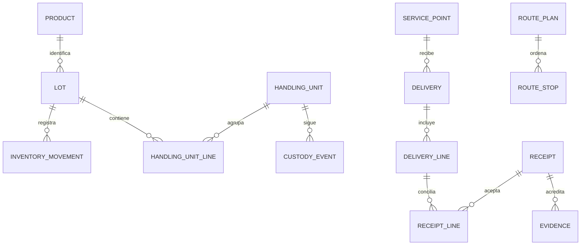

# Modelo de datos

Modelo lógico inicial y reglas de dominio. El catálogo físico objetivo, con columnas, claves, índices, restricciones, RLS y orden de migración, está en [[Esquema completo de base de datos]] desde el 9 de octubre. La bóveda define diseño; la implementación vive en el repositorio de software y su estado no se deduce de estas notas.

## Entidades

| Entidad | Datos esenciales / relación |
|---|---|
| Organization | Operación propietaria; inicialmente IstpetDev usa una empresa demo |
| Account | Identidad externa validada (issuer, subject); cuenta humana o técnica, sin contraseñas propias |
| OrganizationAccess | Membresía cuenta–organización activa/revocada; roles y ámbitos en AccessRole/AccessLocation/AccessServicePoint y DeliveryAssignment |
| Role / Permission / RolePermission | Roles administrables por organización y asociación con acciones implementadas del servidor |
| ConfigurationVersion / ConfigurationActivation | Parámetros validados/versionados y vigencia por ámbito |
| Template / TemplateVersion / TemplateField | Plantillas y campos declarativos versionados, publicados inmutables |
| FormSubmission | Captura validada contra una versión de plantilla, contexto operativo y actor autorizado |
| WorkflowVersion / WorkflowState / WorkflowTransition | Estados/transiciones configurados sobre comandos implementados |
| ServicePoint | Cliente, ubicación, criticidad y ventana; pertenece a organización |
| Location | Almacén, punto, vehículo o ubicación de cuarentena |
| Product/SKU | Unidad base, conversión de empaque, peso/volumen por unidad |
| Lot | SKU, origen, vencimiento, condición y UUID |
| HandlingUnit | Caja/unidad QR con líneas de lote/cantidad |
| InventoryMovement | Tipo, origen/destino, lote, cantidad, actor y operación |
| StockBalance | Proyección por organización/ubicación/lote y versión |
| Reservation | Cantidad reservada para una línea de entrega |
| Consumption | Consumo de punto/SKU con origen del dato |
| ReplenishmentRequest | Punto, cantidades y necesidad temporal |
| Vehicle | Peso/volumen máximos, disponibilidad y condiciones |
| RoutePlan/RouteStop | Versión, vehículo, secuencia, ventana y estado |
| Delivery/DeliveryLine | Organización, punto, ruta, conductor asignado, lote y cantidades planificadas/despachadas |
| Receipt/ReceiptLine | Cantidad aceptada/rechazada, entrega y fecha de aceptación |
| Evidence | Referencia privada de archivo ligada a recepción |
| CustodyEvent | Hito, actor, unidad, ubicación y cantidades |
| RiskSnapshot | Datos de entrada, fórmula, versión y resultado |
| Incident | Segmento/punto afectado, fuente, severidad y bandera demo |
| Conversation/Message | Participantes autorizados, asignación e historial |
| IdempotencyRecord | OperationId, actor/ámbito, huella y resultado |
| OutboxEvent | Evento persistido y estado de publicación |
| SimulationRun | Seed, dataset, políticas, parámetros y resultados |

Estas entidades no obligan a crear un microservicio por tabla. El dataset y las simulaciones pueden vivir en un esquema separado para impedir mezclas con operación.

ADR-16, aceptada por Bryan el 9 de octubre, sustituye el diseño inicial de roles fijos sin editor dinámico: Role y sus concesiones son administrables desde DB por organización. Permission sigue representando acciones implementadas. Toda asignación/revocación conserva actor, fecha y motivo de auditoría. Rol, campo y ámbito se validan conjuntamente, según [[RBAC y configuracion del sistema]] y [[Seguridad y evidencias]].

## Relaciones principales

## Cantidades y unidades

- Una unidad base por SKU: L, kg o unidad, según producto.
- Usar decimal/numeric para cantidades y dinero; definir escala y redondeo.
- Cada conversión de caja/bidón a unidad base es explícita y versionada.
- No sumar litros, kilos y cajas en un único «stock total».
- Capacidad del vehículo calcula peso y volumen desde líneas y conversión.
- Un lote puede estar en varias ubicaciones y entregas parciales.
- El stock en vehículo sigue siendo inventario; no desaparece al despachar.

## Invariantes

1. Cantidad positiva en movimientos/recepciones; ajustes excepcionales auditados.
2. Saldo disponible = existencia utilizable − reservas; bloqueados/vencidos excluidos.
3. Despachar no supera reserva/stock; recibir no supera lo despachado pendiente.
4. Reservar no aumenta ni reduce la existencia física.
5. Una transferencia registra origen/destino coherentes y conserva cantidades.
6. El ledger y su proyección se actualizan en un commit.
7. Operación aceptada una sola vez; duplicado de negocio también validado.
8. Toda entidad operativa pertenece a un ámbito autorizado.
9. Correcciones del historial usan compensación y motivo.
10. Fechas de dispositivo y servidor permanecen separadas.

## Movimientos iniciales

Entrada, traslado a vehículo, entrega al punto, consumo, devolución, bloqueo/desbloqueo y ajuste conciliado. Separar consumos/pérdidas de transferencias para no contarlas dos veces.

Control de balance por SKU/lote: **existencia final + consumo + pérdidas confirmadas = existencia inicial + entradas externas + ajustes netos autorizados**. Las transferencias internas se cancelan en el total de la red; reservas no afectan ese total.

## Índices y constraints

Propuestas a validar con consultas reales:

- Unicidad de operationId dentro del ámbito acordado.
- Unicidad de saldo por organización/ubicación/lote.
- Índice de movimientos por ámbito, lote y fecha servidor.
- Índices de entregas por punto/estado/fecha y mensajes por conversación/secuencia.
- Restricciones de cantidades y referencias.
- GiST para ubicación espacial cuando la consulta lo use.

UUID v7 no sustituye estos controles. Para orden temporal de negocio, usar timestamp del servidor y secuencia/versiones, no solo el ID.

Ver [[Contratos API y eventos]], [[Seguridad y evidencias]] y [[Dataset y escenarios]].
