# Plan de ejecución

Plan propuesto desde el **6 de octubre de 2026** para llegar al 16 con la mayor parte del sistema integrado. La preparación de código se adapta a las respuestas de [[Consultas para la organizacion]]. No implica que el trabajo ya esté construido.

## Calendario de preparación

| Fecha | Entrega / resultado | Puerta de cierre |
|---|---|---|
| 6 oct. | Bóveda, alcance, contratos y escenarios base | Contexto compartido y pendientes explícitos |
| 7 oct. | Decisiones iniciales, setup local, fixture pequeño y bootstrap de infraestructura | Versiones fijadas, contratos revisados y dependencias reproducibles |
| 8 oct. | Capacitación, reglas/datos y adaptación del alcance | Respuestas registradas; preparación conforme a reglas confirmadas |
| 9 oct. | Primer flujo vertical: lote → riesgo → entrega → recepción online | Misma operación funciona en API, web y móvil |
| 10 oct. | Inventario transaccional, QR, custodia y planner factible | Duplicados/excesos controlados; ruta explicada |
| 11 oct. | Recepción offline y evidencias | Reinicio, pérdida de respuesta y reintento sin duplicar |
| 12 oct. | Integración cloud, SignalR, chat y recuperación | Teléfono real por HTTPS; varias réplicas si se habilitan |
| 13 oct. | Dataset 80 puntos/90 días y simulador | Balance correcto y políticas comparables |
| 14 oct. | n8n, explicación IA, incidente y replanificación | Fallback y versiones consistentes |
| 15 oct. | Validación, exportaciones, pitch y respaldo | Recorrido ensayado, video y paquete preparado |

Es una secuencia de hitos, no reparto de tareas. Con cinco integrantes experimentados pueden avanzar frentes independientes, conservando contratos y dependencias.

## Entregas y dependencias

```mermaid
flowchart TD
  A["Versiones + contratos + fixture"] --> B["Inventario y custodia"]
  A --> C["Interfaces web/móvil"]
  B --> D["Riesgo y planificación"]
  B --> E["Recepción offline"]
  C --> E
  D --> F["Comparación y simulador"]
  D --> G["n8n + IA + incidentes"]
  E --> H["Demo integrada"]
  F --> H
  G --> H
  I["Terraform + hosting + HTTPS"] --> H
  H --> J["Validación + pitch + contingencias"]
```

## Día 1 — 16 de octubre

Revisar ficha final y datos reales del reto. Ajustar supuestos, prioridad, algoritmos y UX con mentoría. Registrar aportes del evento. Integrar cambios y repetir el recorrido central antes del checkpoint de 18:30.

El objetivo es llegar preparados y usar la jornada para adaptación y validación, dentro de las reglas confirmadas. No inventar que el código previo se creó durante el evento.

## Día 2 — 17 de octubre

Finalizar cambios esenciales temprano. Ejecutar pruebas con usuario/mentor y capturar evidencia entre 11:00 y 12:30. Cerrar negocio y viabilidad, ensayar con tiempo confirmado y congelar materiales a las 15:45 como meta interna.

## Qué se puede adaptar al último momento

Demanda, puntos, lead time, capacidades, costo/km, ventanas, criterios de criticidad y escenarios son parámetros versionados. Mantener contratos y reglas estables; si un requisito oficial obliga a cambiarlos, registrar versión y nueva validación.

## Reglas de recorte

- Conservar P0 y evidencia fiable.
- Recortar extras visuales antes de robustez de inventario/offline.
- Conservar comparación justa antes de añadir IA más compleja.
- Si falla cloud, usar contingencia declarada y mantener acceso por HTTPS cuando corresponda.
- No congelar cifras antes de validar el run que se mostrará.

Consultar [[Backlog]], [[Plan de validacion]] y [[Checklist y contingencias]].
